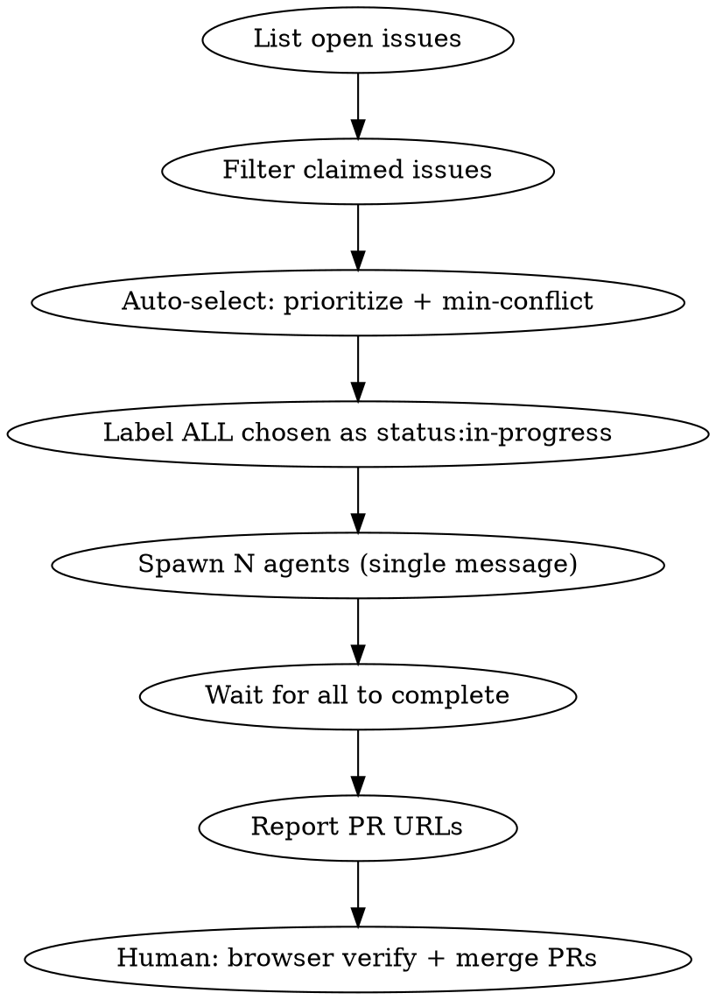

# Parallel Issue Fixer

## Overview

Spawn N isolated subagents in a single message, each fixing one GitHub issue independently. Solves three concurrency problems: triage races, shared-file merge conflicts, and Chrome DevTools contention — by claiming issues upfront, using PRs instead of direct merges, and skipping per-agent browser verify.

## Flow



## Step 1: Determine Context

```bash
BASE_BRANCH=$(git rev-parse --abbrev-ref HEAD)
REPO=$(gh repo view --json nameWithOwner -q .nameWithOwner)
```

## Step 2: Auto-Select Issues (no user prompt)

If invoked with explicit args like `192 193 194 195`, use those directly and skip auto-selection.

Otherwise, run the conflict-aware greedy selector. It sorts by issue number (oldest = highest priority), derives a conflict zone from the conventional-commit scope + first keyword (`feat(mobile): owner …` → `mobile/owner`), then greedily picks up to 6 issues with zero zone overlap. Works with any repo that uses conventional commits; falls back to first 3 words for titles without a type prefix.

```bash
gh issue list --repo $REPO --state open --json number,title,labels \
  | python3 -c "
import sys, json, re

def zone(title):
    t = title.lower().strip()
    # feat(scope): rest  →  scope/first-word
    m = re.match(r'(?:feat|fix|refactor|chore|docs|perf|test|style|build|ci)\(([^)]+)\):\s*(.*)', t)
    if m:
        scope = m.group(1).strip()
        first = re.split(r'[\s:/]', m.group(2).strip())[0]
        return f'{scope}/{first}' if first else scope
    # type: rest  →  type/first-word
    m = re.match(r'(feat|fix|refactor|chore|docs|perf|test|style|build|ci):\s*(.*)', t)
    if m:
        first = re.split(r'[\s:/]', m.group(2).strip())[0]
        return f'{m.group(1)}/{first}' if first else m.group(1)
    # fallback: first 3 words
    return ' '.join(t.split()[:3])

issues = json.load(sys.stdin)
unclaimed = [i for i in issues if not any(l['name'] == 'status:in-progress' for l in i['labels'])]
unclaimed.sort(key=lambda i: i['number'])

selected, claimed = [], set()
for issue in unclaimed:
    if len(selected) >= 6:
        break
    z = zone(issue['title'])
    if z not in claimed:
        selected.append(issue)
        claimed.add(z)

print('Auto-selected batch (oldest-first, min conflict):')
for i in selected:
    print(f\"  #{i['number']}: {i['title']}\")
print()
print(' '.join(str(i['number']) for i in selected))
"
```

The last line of output is the space-separated issue numbers to use.

**Do NOT ask the user to confirm or approve the selection.** Proceed directly to Step 3.

**Max 6 agents at once.** More than 6 degrades quality and hits resource limits.

## Step 3: Claim All Issues Before Spawning

**CRITICAL: Label ALL chosen issues before spawning a single agent.** If you spawn first and label second, two agents may claim the same issue.

```bash
for N in <issue numbers>; do
  gh issue edit $N --repo $REPO --add-label "status:in-progress"
done
```

## Step 4: Spawn Agents in Parallel

Call the `Agent` tool **N times in a single message** — one call per issue. Each subagent starts with zero context from this conversation.

Each subagent prompt must be fully self-contained. Use this template:

```
You are fixing GitHub issue #<NUMBER> in repo <REPO>.

Context:
- Base branch: <BASE_BRANCH>
- Issue already labeled status:in-progress — skip claiming step
- Working directory: <absolute path to repo>

Instructions:
1. Invoke Skill("github-issue-fixer:fix") with args "<NUMBER>"
2. When the skill reaches Step 1 (triage): SKIP IT. Issue #<NUMBER> is already selected.
3. When the skill reaches Step 5 (commit + merge): DO NOT merge to base branch.
   Instead: push branch, open a PR targeting <BASE_BRANCH>, then stop.
   Use: gh pr create --base <BASE_BRANCH> --title "fix: <issue title> (#<NUMBER>)" --body "Closes #<NUMBER>"
4. Do NOT close the GitHub issue — leave it open for human review after PR merge.
5. Do NOT run browser verify — leave that to the human reviewing the PR.

Go.
```

## Step 5: Report Results

After all agents complete, collect and display:

```
## Parallel Fix Results

| Issue | PR | Status |
|-------|----|--------|
| #192  | https://github.com/.../pull/X | ✅ opened |
| #193  | https://github.com/.../pull/Y | ✅ opened |
| #194  | — | ❌ failed: <reason> |

Next steps:
- Browser verify each PR branch before merging
- Resolve any _layout.tsx conflicts manually (multiple issues may touch same file)
- Merge PRs in order to minimize conflicts
- Close issues after merge
```

If an agent failed: re-run it solo with `/github-issue-fixer:fix` for that issue number.

## Known Conflict Zones

Issues in the same zone share a conflict zone key (same `scope/first-word`) and will likely touch the same files — navigation layouts, route registries, shared config. The auto-selector prevents two same-zone issues from being in the same batch. If you override with explicit args and include same-zone issues, merge their PRs **sequentially**: merge first, then rebase the next branch before merging.

## Rules

- Never spawn agents without claiming issues first (Step 3 is non-negotiable)
- Never exceed 6 parallel agents
- Agents open PRs — they never merge directly, never close issues
- Browser verify is the human's responsibility after PR review
- A failed agent is not a failure of the whole batch — report it and continue
