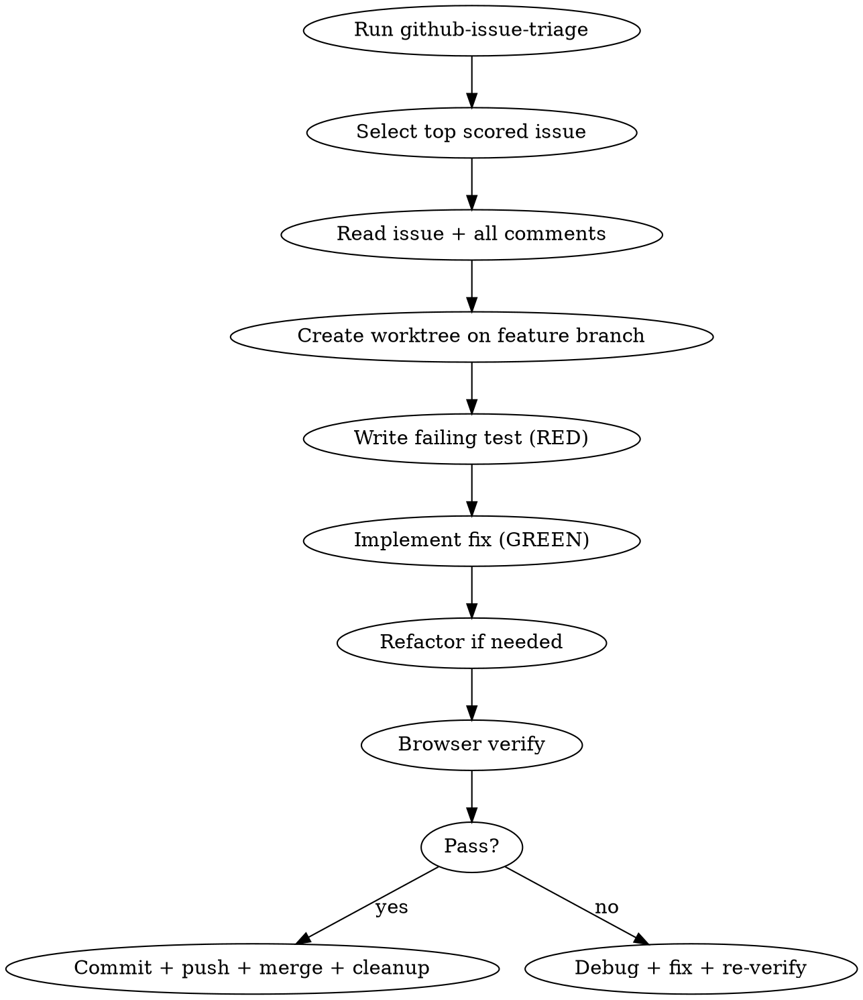

# Issue Fixer Agent

## Overview
Autonomous loop: triage → select top issue → TDD implementation → browser verification → close.

**NON-NEGOTIABLE:** All development in this skill MUST use TDD, even when the user does not explicitly mention TDD. No production implementation code before a failing test exists and has been run RED.

## Flow



## Step 0: Activate Caveman Mode

Invoke `caveman:caveman` skill with argument `ultra` before doing anything else.

## Step 1: Triage

Invoke `github-issue-triage` skill. After triage display, automatically select the top-scored issue — do NOT ask for confirmation. Proceed immediately to Step 2.

## Step 2: Claim Issue

Label the issue immediately so other agents skip it:

```bash
gh issue edit <number> --add-label "status:in-progress"
```

Then read it:

```bash
gh issue view <number> --comments
```

Extract:
- What is broken / what is missing
- Reproduction steps
- Expected vs actual behavior
- Any constraints in comments

## Step 2.5: Create Worktree

**REQUIRED SUB-SKILL:** `superpowers:using-git-worktrees`

Before touching any code, detect the current working branch and isolate work in a git worktree. **Never branch from or merge into `main` — that is production.**

```bash
BASE_BRANCH=$(git rev-parse --abbrev-ref HEAD)
git fetch origin
git worktree add .worktrees/issue-<number> -b fix/issue-<number> origin/$BASE_BRANCH
cd .worktrees/issue-<number>
```

`.env` files are gitignored and not copied into worktrees — copy only files that exist, and never commit them:

```bash
MAIN_CHECKOUT="$(cd ../.. && pwd)"
for file in .env .env.local backend/.env backend/.env.test frontend/.env frontend/.env.local; do
  if [ -f "$MAIN_CHECKOUT/$file" ]; then
    mkdir -p "$(dirname "$file")"
    cp "$MAIN_CHECKOUT/$file" "$file"
  fi
done
```

Install deps per subdirectory (node_modules are not shared). Follow repo supply-chain policy: install with scripts disabled, then rebuild native packages only if present.

```bash
# Auto-detect every package directory (works for monorepos and single-package repos)
find . -maxdepth 3 -name package.json -not -path '*/node_modules/*' \
  | xargs -I{} dirname {} | sort | while read dir; do
    if [ -f "$dir/package-lock.json" ]; then
      (cd "$dir" && npm ci --ignore-scripts)
    else
      (cd "$dir" && npm install --ignore-scripts)
    fi
  done

# Rebuild any native addon packages (auto-detected via binding.gyp — no hardcoded list)
find . -maxdepth 7 -name binding.gyp \
  -not -path '*/node_modules/node_modules/*' \
  -not -path '*/.worktrees/*' 2>/dev/null | while read gyp; do
    pkg_name=$(basename "$(dirname "$gyp")")
    root_dir=$(dirname "$(dirname "$(dirname "$gyp")")")
    (cd "$root_dir" && npm_config_ignore_scripts=false npm rebuild "$pkg_name" --foreground-scripts) || true
  done
```

All implementation (tests, fixes, commits) happens inside this worktree. The main workspace stays clean.

## Step 3: TDD Implementation

**REQUIRED SUB-SKILL:** `superpowers:test-driven-development`

This step applies to every code change: bugfixes, features, refactors that alter behavior, incidental easy fixes, and CI/build fixes. If code behavior changes, start with a failing test. If no automated test is possible, document why, create the smallest executable verification script or manual browser check before implementation, and still follow RED → GREEN discipline.

Strict order:
1. Write test that fails because the bug exists / feature is missing
2. `npm test` → confirm RED (test fails for the right reason)
3. Write minimal fix
4. `npm test` → confirm GREEN
5. Refactor only if code is unclear; re-confirm GREEN

Never write implementation before test. Never skip RED confirmation. If implementation was written first by mistake, revert/delete it and restart from the failing test.

## Step 4: Browser Verify

**REQUIRED SUB-SKILL:** `browser-feature-verify`

**CRITICAL:** Chrome must be running before any MCP tool call. The MCP does NOT auto-launch Chrome on this system. Follow the pre-flight in `browser-feature-verify` exactly — start Chrome first, confirm `list_pages` returns results, then proceed.

Follow the full checklist: golden path, console, network, edge cases, regression.

Do not mark issue done until PASS verdict.

## Step 5: Commit, Push, Merge + Cleanup

From inside the worktree (`.worktrees/issue-<number>`):

```bash
git add <changed files>
git commit -m "fix: <issue title> (#<number>)"
git push -u origin fix/issue-<number>
```

**Push is MANDATORY before commenting or closing.** Code not on remote = issue not fixed.

Merge back into the base branch (the branch the workspace was on before the worktree was created — never `main`) and remove the worktree:

```bash
BASE_BRANCH=$(git rev-parse --abbrev-ref HEAD)  # run from original workspace, not worktree
cd <original workspace>
git merge fix/issue-<number>
git push
git worktree remove .worktrees/issue-<number>
git branch -d fix/issue-<number>
git push origin --delete fix/issue-<number> 2>/dev/null || true
```

Comment on the GitHub issue:
```bash
gh issue comment <number> --body "Fixed in <commit-sha>. <one sentence describing what changed>."
```

**REQUIRED ORDER:** Merge to base branch (`git merge` + `git push`) MUST complete before closing the issue. Closing before merging = orphaned branch, incomplete integration. Never touch `main` — that is production-only.

Remove the in-progress label, then close:
```bash
gh issue edit <number> --remove-label "status:in-progress"
gh issue close <number>
```

## Step 6: Handle Incidental Issues Found

During implementation or browser verify, you may spot bugs/problems unrelated to the current issue. For each one:

**Assess effort:**
- **Easy** (< 30 min, isolated change, no design decisions needed) → fix it now, commit separately
- **Hard** (requires design, touches multiple systems, uncertain scope) → create GitHub issue

```bash
# For hard issues:
gh issue create --title "fix: <short description>" --body "<what is broken, where, and what the expected behavior should be>"
```

Do not let incidental issues block closing the current issue. Fix or file, then move on.

## Rules

- One issue at a time. Fully done before next.
- Always use TDD for all development. User silence about TDD is not permission to skip it.
- Never skip TDD. Even for "obvious" one-liners, CI fixes, small refactors, or incidental easy fixes.
- Never mark complete without browser PASS.
- Merge to base branch (never `main`) BEFORE closing the GitHub issue. The merge is the signal work is done, not the close.
- If issue is ambiguous, comment asking for clarification before implementing.
- If fix touches auth/security: extra browser verify with wrong-role user.
